# SportSystem
A web application for managing different sports matches and selling tickets, designed for the following user types: **_Fans_**, **_Sports Association Managers_**, **_Club Representatives_**, **_Stadium Managers_**, **_Admins_**

## Screenshots

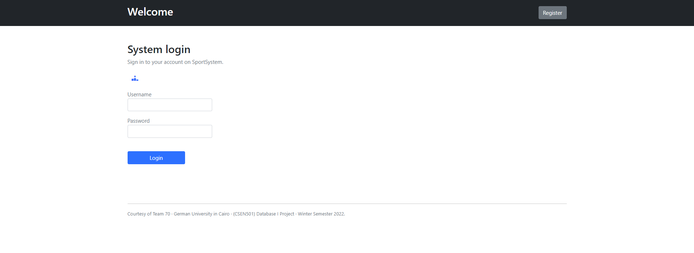

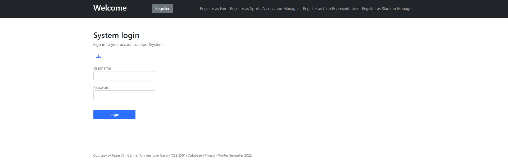

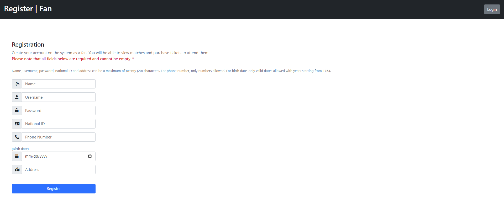

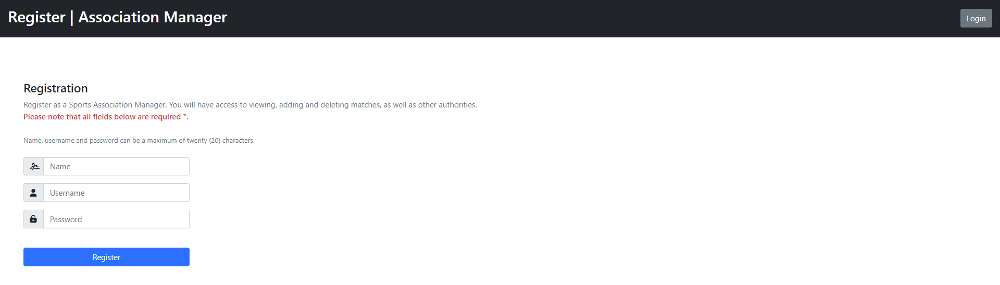

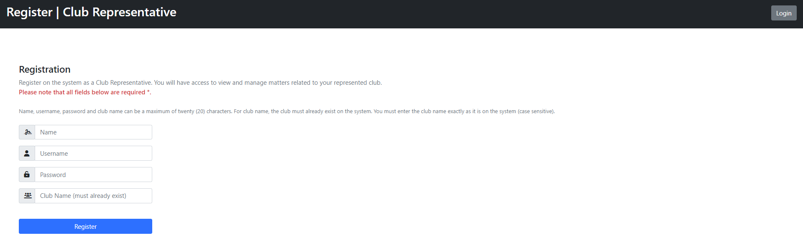

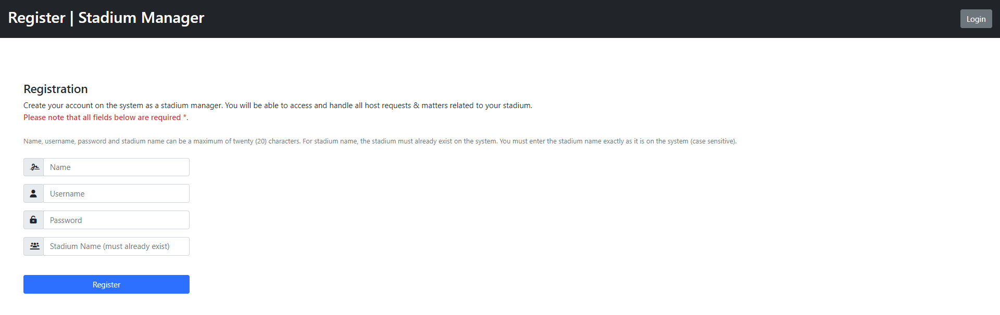

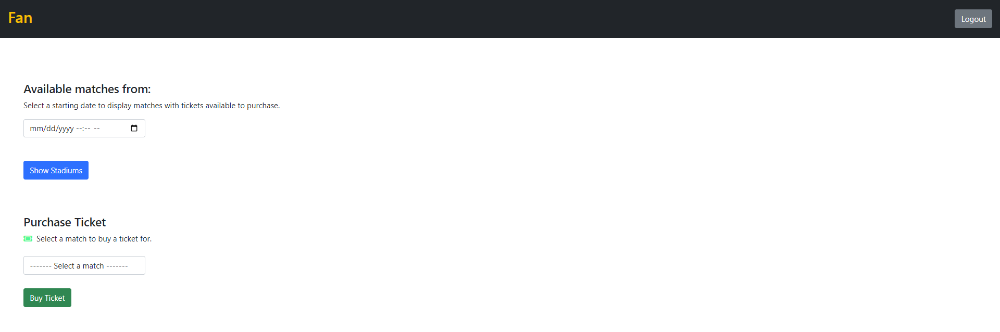

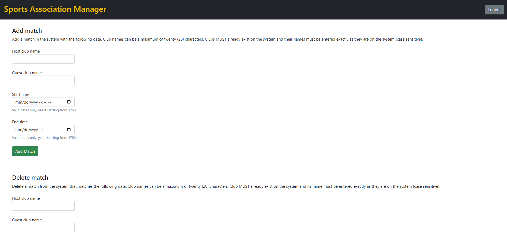

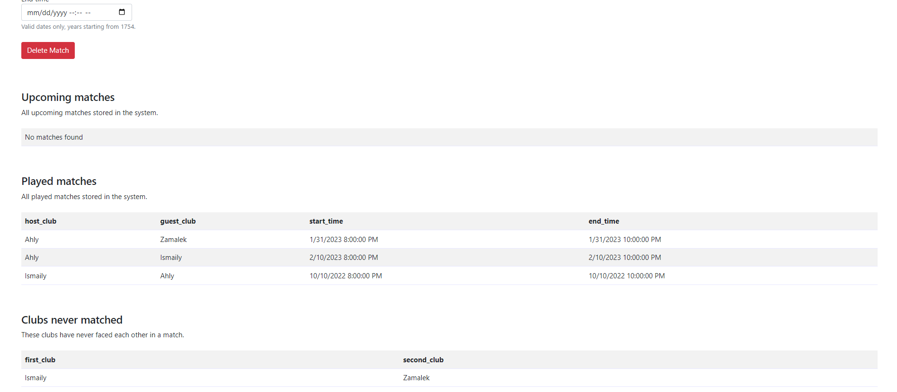

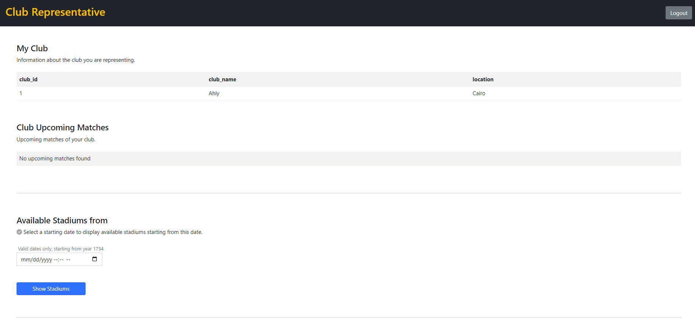

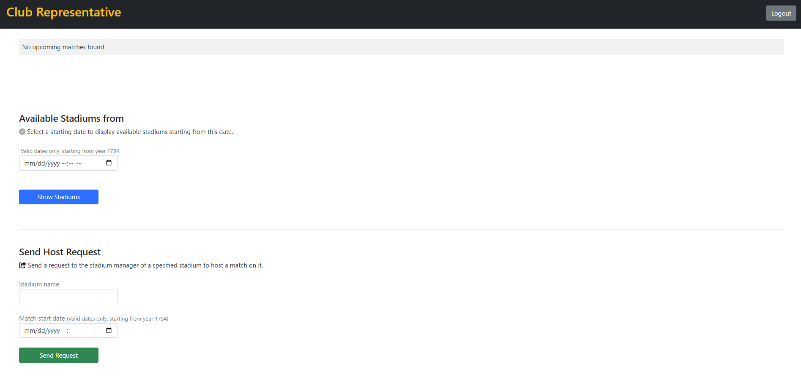

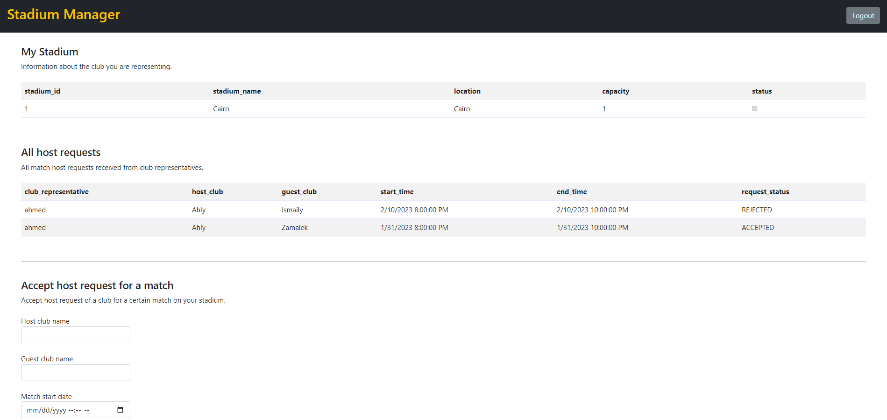

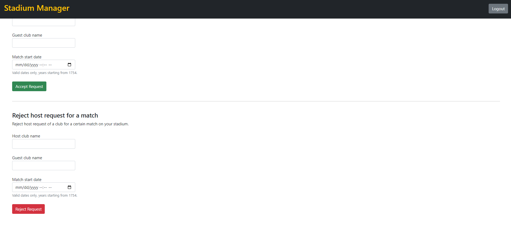

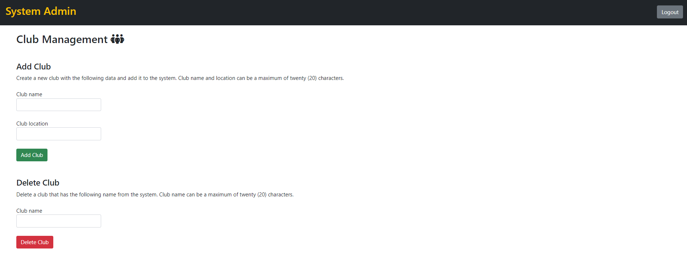

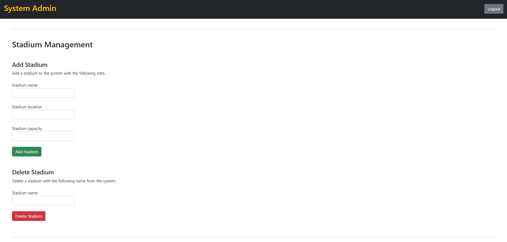


## Technologies Used

- ASP.NET
- C#
- Microsoft SQL Server
- Bootstrap
- Fontawesome

## Getting Started

To get started, clone the repository by running the following command:

```bash
git clone https://github.com/mahmoudaboueleneen/SportSystem.git
```

## Authors
- [@abdelrahmanAbouelkheir](https://github.com/abdelrahmanAbouelkheir)
- [@mahmoudaboueleneen](https://github.com/mahmoudaboueleneen)
- [@Ahmedsherif74](https://github.com/Ahmedsherif74)
